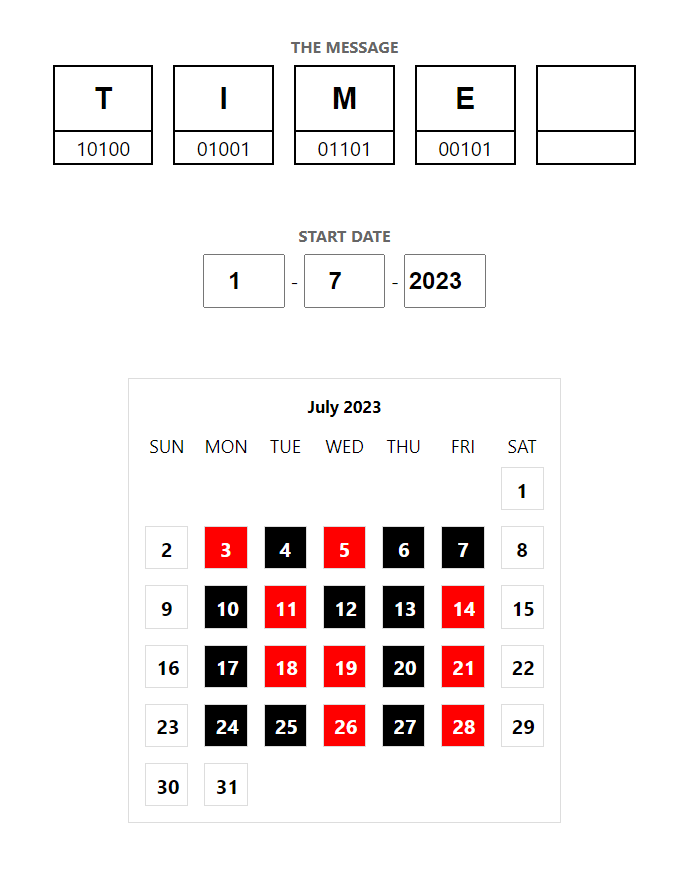

# Dress code ([demo](https://tito433.github.io/dress-code/))

This application converts any text message into wearable dress codes. Consider every day as a bit which can be either zero or one. Say when you wear black shirts will represents zero and red shirts for one. Hence every day you can print or display one bit using black or red dress. In a week you can display an alphabet.

## The ASCII table for 5 bits

| Alphabet  | ASCII value | Binary | Alphabet  | ASCII value | Binary |
| ------------- | ------------- | ------------- |------------- | ------------- | ------------- |
| A  | 1  | 00001 | N  | 14  | 01110 |
| B  | 2  | 00010 | O  | 15  | 01111 |
| C  | 3  | 00011 | P  | 16  | 10000 |
| D  | 4  | 00100 | Q  | 17  | 10001 |
| E  | 5  | 00101 | R  | 18  | 10010 |
| F  | 6  | 00110 | S  | 19  | 10011 |
| G  | 7  | 00111 | T  | 20  | 10100 |
| H  | 8  | 01000 | U  | 21  | 10101 |
| I  | 9  | 01001 | V  | 22  | 10110 |
| J  | 10  | 01010 | W  | 23  | 10111 |
| K  | 11  | 01011 | X  | 24  | 11000 |
| L  | 12  | 01100 | Y  | 25  | 11001 |
| M  | 13  | 01101 | Z  | 26  | 11010 |
|< space >| 27 |11011||||

### `Example`

Say you want to print `TIME`. First, We split each alphabet and get binary values:
| Alphabet  | ASCII value | Binary |
| ------------- | ------------- | ------------- |
| T  | 20  | 10100 |
| I  | 9  | 01001 |
| M  | 13  | 01101 |
| E  | 5  | 00101 |

Then for each alphabet we assign it to a week. So for `T(10100)` your dress code for a week will be:
| Days | Sunday  | Monday | Tuesday | Wednesday | Thursday  | Friday | Saturday |
| ------------- | -------------  | ------------- | ------------- | ------------- | -------------  | ------------- | ------------- |
| <b>Binary</b> | 1  | 0 | 1 | 0 | 0  |  |  |
| <b>Color</b>  | Red  | Black | Red | Black | Black  |  |  |

You do this for the rest of the alphabets. 
Now you have the idea. Write a novel or poem or send secret messages. Here's the app user interface:

>Your only limitation is your imagination.